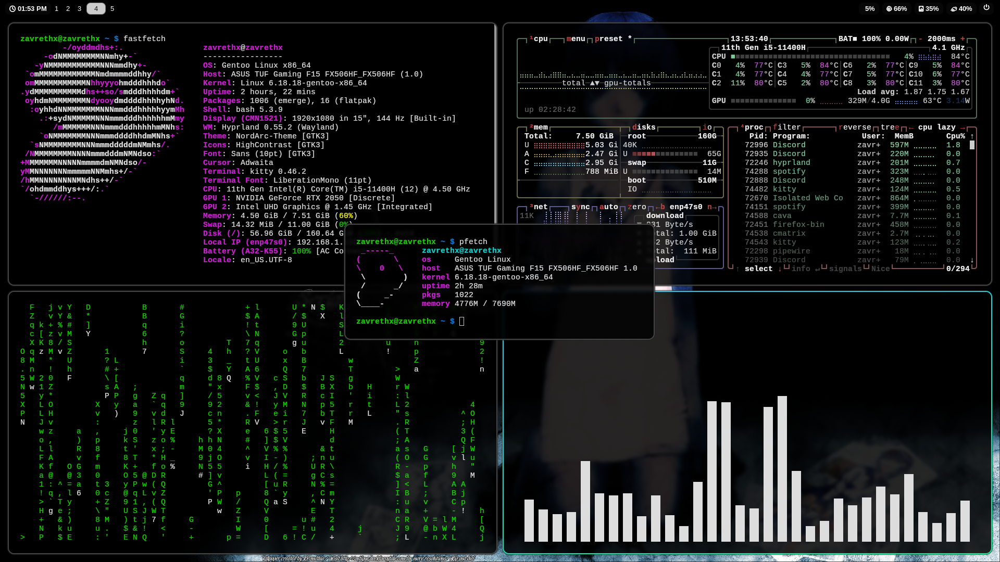

# My-own-Hyprland-dotfiles

Gentoo Linux + Hyprland rice

## Dependencies

- hyprland
- waybar
- kitty
- rofi
- swaybg / waypaper
- pipewire
- brightnessctl
- hyprshot
- grim + slurp
- playerctl
- pavucontrol

## Installation

Clone the repo and copy configs:

\```bash
git clone https://github.com/Zavrethx/My-own-Hyprland-dotfiles.git
cp -r My-own-Hyprland-dotfiles/.config ~/.config
\```


